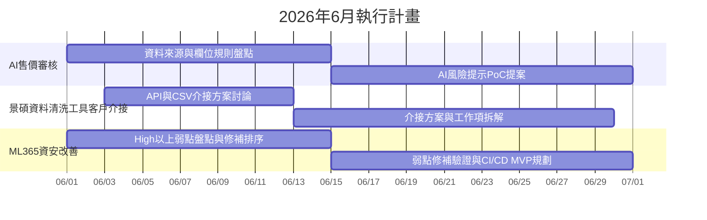

# 2026年5月工作成果與6月執行計畫

## 30秒摘要

5 月完成 AI 售價審核需求收斂與 AI 輔助需求整理流程驗證，6 月聚焦 AI 售價審核 PoC 提案、景碩資料清洗工具客戶介接方案，以及 ML365 High 以上弱點清零與安全交付流程 MVP 規劃。

## 5月成果

### AI 售價審核需求收斂

- 完成 2 場使用者訪談與 5/20 現場跟訪，協助團隊把 AI 題目收斂成可執行的資料來源、判斷條件與欄位規則盤點。
- 已明確定義 6 月工作重心是 AI 決策輔助與風險提示，不直接承諾取代人工判斷或自動判價。

### AI 會議紀錄與需求萃取流程驗證

- 將會議內容轉成可追蹤的需求與規格素材，驗證一套 AI 輔助的會議紀錄與需求整理流程。
- 這套做法可降低需求漏接、反覆確認與重工，後續可複製到其他 AI 專案。

### ML365 資安改善方向規劃

- 針對 6 月 High 以上弱點清零目標，先完成修補方向與執行順序盤點。
- 安全交付流程先以 MVP 規劃與初版工作項拆解為主，6 月先聚焦可驗證的階段成果。

## 優良事蹟

### 可平展的 AI 輔助需求整理與開發 SOP

- 採用 Openspec 以 SDD 流程建立一套「先整理需求、再明確規格、最後交付驗證」的 AI 輔助工作方式，讓 AI 的使用從個人技巧轉成可複製流程。
- 對處內的價值是讓同仁未來能更安全地使用 AI 做需求整理、規格產生與變更前檢查，降低重工與溝通成本。

## 6月計畫

### AI 售價審核

- 6/1-6/14：完成資料來源、判斷條件與欄位規則盤點。
- 6/15-6/30：提出 AI 風險提示與決策輔助方向的 PoC 提案。

### 景碩資料清洗工具 客戶介接

- 6/3-6/13：啟動 API / CSV 匯入介接討論，確認客戶資料落地方式。
- 6/14-6/30：完成介接方案與工作項拆解，作為後續實作依據。

### ML365 資安改善

- 6/1-6/14：完成 High 以上弱點盤點與修補順序確認。
- 6/15-6/30：執行弱點修補驗證，並完成 CI/CD 安全流程 MVP 規劃與初版拆解。

## Mermaid Gantt

## 靜態時程表

| 專案 | 期間 | 重點輸出 |
| --- | --- | --- |
| AI 售價審核 | 6/1-6/30 | 資料來源與規則盤點、AI 風險提示 PoC 提案 |
| 景碩資料清洗工具 客戶介接 | 6/3-6/30 | API / CSV 介接方案、工作項拆解 |
| ML365 資安改善 | 6/1-6/30 | High 以上弱點清零、CI/CD 安全流程 MVP 規劃 |